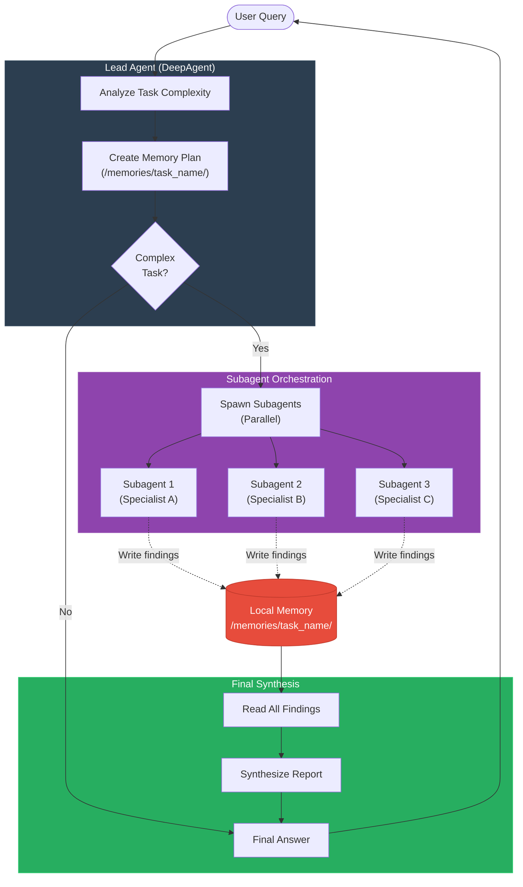

# DeepAgent - Multi-Agent Orchestration

**DeepAgent** extends OmniCoreAgent with **autonomous multi-agent orchestration**. It automatically breaks down complex tasks and delegates them to specialized subagents running in parallel.

## Quick Start

```python
from omnicoreagent import DeepAgent

# Create a DeepAgent
agent = DeepAgent(
    name="research_coordinator",
    system_instruction="You are a research coordinator specializing in tech analysis.",
    model_config={"provider": "openai", "model": "gpt-4o"},
)

# Initialize (registers subagent spawning tools)
await agent.initialize()

# Run a complex task - it will spawn subagents automatically
result = await agent.run("""
Research the benefits of Rust vs Go for cloud-native applications.
Consider performance, developer experience, and ecosystem maturity.
""")

print(result["response"])
await agent.cleanup()
```

---

## How It Works

DeepAgent extends OmniCoreAgent with two specialized tools:

### 1. `spawn_subagent`
Spawns a single focused subagent.

```python
# The lead agent can call this tool
{
    "name": "performance_researcher",
    "role": "Performance benchmarking specialist",
    "task": "Research runtime performance of Rust vs Go for web services",
    "output_path": "/memories/research/performance"
}
```

### 2. `spawn_parallel_subagents`
Spawns multiple subagents that run in parallel.

```python
# The lead agent can call this tool
[
    {"name": "perf", "role": "Perf expert", "task": "Benchmark tests", "output_path": "/memories/perf"},
    {"name": "dx", "role": "DevEx expert", "task": "Compare tooling", "output_path": "/memories/dx"},
    {"name": "ecosystem", "role": "Ecosystem analyst", "task": "Library coverage", "output_path": "/memories/ecosystem"}
]
```

---

## Architecture



### Memory-First Workflow

**Why subagents write to memory instead of returning results:**

1. **Survives context resets** - Findings persist even if the lead agent's context is truncated
2. **Parallel execution** - Multiple subagents can write concurrently without conflicts
3. **Incremental progress** - Lead agent can read partial results before all subagents finish
4. **Token efficiency** - Avoids bloating context with large intermediate outputs

---

## DeepAgent vs OmniCoreAgent

| Feature | OmniCoreAgent | DeepAgent |
|---------|---------------|-----------|
| **Domain** | User-defined | User-defined (same) |
| **Tools** | User-provided | User-provided + orchestration tools |
| **Memory Backend** | Optional | **Always `"local"`** (enforcement) |
| **Orchestration** | No | Automatic subagent spawning |
| **Config Inheritance** | N/A | Subagents inherit parent config |
| **Best For** | Single-agent tasks | Complex multi-step research/analysis |

---

## Configuration

DeepAgent uses **smart defaults** optimized for multi-agent orchestration:

```python
agent = DeepAgent(
    name="analyst",
    system_instruction="Your domain-specific instruction",
    model_config={"provider": "openai", "model": "gpt-4o"},
    agent_config={
        # These are the defaults (you can override):
        "max_steps": 50,  # More steps for orchestration
        "tool_call_timeout": 600,  # 10 min (subagents do deep work)
        "memory_tool_backend": "local",  # ENFORCED (cannot override)
        "context_management": {"enabled": True},
        "tool_offload": {"enabled": True},
    }
)
```

### Key Config Notes

- **`memory_tool_backend`**: Always `"local"` (required for orchestration) - cannot be overridden
- **`max_steps`**: Increased to `50` to allow for multi-agent coordination
- **`tool_call_timeout`**: Set to `600s` because subagents may do research, API calls, etc.

---

## Full API

```python
from omnicoreagent import DeepAgent

# 1. Create
agent = DeepAgent(
    name="coordinator",
    system_instruction="Your domain instruction",
    model_config={"provider": "openai", "model": "gpt-4o"},
    mcp_tools=[...],           # Optional MCP tools
    local_tools=ToolRegistry(),  # Optional local tools
    agent_config={...}          # Optional config overrides
)

# 2. Initialize (registers orchestration tools)
await agent.initialize()

# 3. Run
result = await agent.run(query, session_id="optional_session")

# 4. Properties
agent.is_initialized  # Check if ready
agent.prompt_builder  # Access custom prompt builder

# 5. Cleanup
await agent.cleanup()
```

---

## Use Cases

### 1. 🔬 Multi-Domain Research
A DeepAgent can spawn subagents for different research angles:
- Technical feasibility
- Market analysis
- Competitive landscape
- Cost projections

### 2. 🏗️ Software Architecture Review
Spawn subagents to analyze different aspects:
- Performance bottlenecks
- Security vulnerabilities
- Scalability concerns
- Code quality metrics

### 3. 📊 Investment Due Diligence
Parallelize analysis of:
- Financial health
- Market opportunity
- Team & execution
- Regulatory risks

### 4. 🧪 Hypothesis Testing
Spawn subagents to:
- Gather supporting evidence
- Find counterexamples
- Analyze edge cases
- Synthesize conclusions

---

## Best Practices

### ✅ DO

- **Use for complex tasks** - DeepAgent shines when tasks have multiple independent subtasks
- **Leverage memory** - Design your task paths (`/memories/project_name/`) for organization
- **Trust the LLM** - Let the lead agent decide when to spawn subagents
- **Check `max_steps`** - Increase if your orchestration needs many steps

### ❌ DON'T

- **Override `memory_tool_backend`** - DeepAgent requires `"local"` memory for orchestration
- **Use for simple tasks** - For single-step tasks, use OmniCoreAgent instead
- **Hardcode subagent specs** - Let the lead agent decide what specialists to spawn based on the query

---

## Advanced Example: Custom Tools + DeepAgent

```python
from omnicoreagent import DeepAgent, ToolRegistry

# Define domain-specific tools
tools = ToolRegistry()

@tools.register_tool("run_sql_query")
def run_sql_query(query: str) -> dict:
    """Execute SQL query and return results."""
    # Your database logic
    return {"rows": [...]}

@tools.register_tool("fetch_api_data")
def fetch_api_data(endpoint: str) -> dict:
    """Fetch data from external API."""
    # Your API logic
    return {"data": {...}}

# Create DeepAgent with your tools
agent = DeepAgent(
    name="data_analyst",
    system_instruction="""
You are a data analyst. You can run SQL queries and fetch API data.
For complex analysis, spawn subagents to handle different data sources.
    """,
    model_config={"provider": "openai", "model": "gpt-4o"},
    local_tools=tools,  # Your tools + orchestration tools
)

await agent.initialize()

# The agent can now use your tools AND spawn subagents
result = await agent.run("""
Analyze Q4 2024 sales performance across all regions.
Compare with API data from our CRM system.
""")
```

---

## Cookbook Examples

- **Basic**: [`cookbook/getting_started/first_deep_agent.py`](https://github.com/omnirexflora-labs/omnicoreagent/blob/main/cookbook/getting_started/first_deep_agent.py) - Simple orchestration
- **Advanced**: [`cookbook/deep_agent/vula_due_diligence/`](https://github.com/omnirexflora-labs/omnicoreagent/tree/main/cookbook/deep_agent/vula_due_diligence/) - Full investment due diligence system

---

## FAQ

**Q: When should I use DeepAgent vs OmniCoreAgent?**
A: Use DeepAgent when your task has multiple independent subtasks that can benefit from parallel execution. Use OmniCoreAgent for single-agent workflows.

**Q: Can I nest DeepAgents?**
A: Technically yes (subagents are OmniCoreAgents), but it's rarely needed. The lead DeepAgent is usually sufficient for 2-3 levels of delegation.

**Q: What if I want to use Redis memory?**
A: DeepAgent enforces `"local"` memory backend for orchestration. If you need Redis for session persistence, use OmniCoreAgent instead or implement custom memory logic.

**Q: How do I monitor subagent progress?**
A: Enable event streaming and filter for `sub_agent_started`, `sub_agent_result`, and `sub_agent_error` events.
